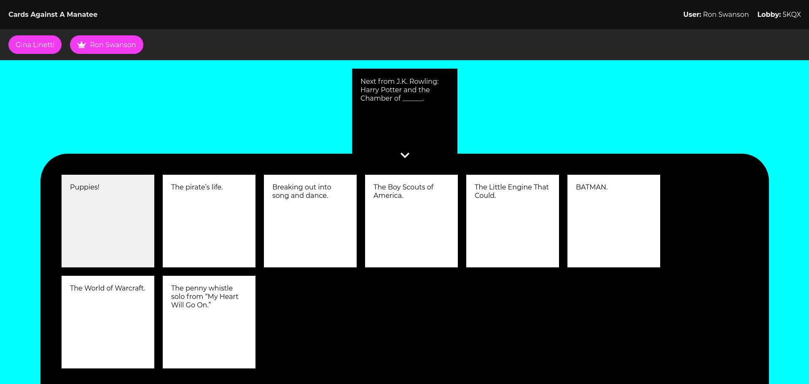
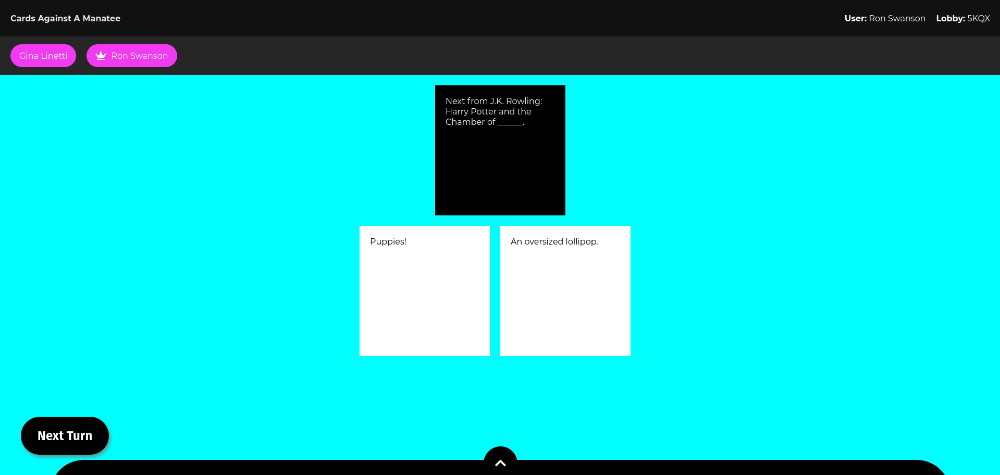

# Cards Against a Manatee
Manatees (family Trichechidae, genus Trichechus) are large, fully aquatic, mostly herbivorous marine mammals sometimes
known as sea cows ([Wikipedia](https://en.wikipedia.org/wiki/Manatee)). _Cards Against a Manatee_ is a digital card
game, which has absolutely nothing to do with said mammal. It's heavily inspired by (but not associated with) the
similarly named game [Cards Against Humanity](https://www.cardsagainsthumanity.com/). Credit for the core game idea and
all the playing cards used in this project goes to Cards Against Humanity.

## Usage
### Cards
Create a directory for your card packages. Each card package is a subdirectory containing two files: `black_cards.csv`
and `white_cards.csv`. The name of the subdirectory is considered to be the name of that card package.

The CSV files have no header. The `black_cards.csv` file has three columns of the form

```
1,Why can’t I sleep at night?,1
```

where the first column is the card ID, the second is the card text, and the last column is the "pick" value, which
indicates how many white cards each player gets to pick for that white card (i.e. the number of blanks on that card).

Similarly, the `white_cards.csv` file is of the form

```
1,Being on fire.
```

where the first column is the card ID and the second is the card text.

When starting the backend, set an environment variable named `CARD_PACKS_BASE_PATH` to the OS-appropriate path
pointing to the card packages base directory (i.e. the directory containing the different card package directories).

**Example:** A directory `/home/me/cards/default` contains two files `black_cards.csv` and `white_cards.csv`. Hence,
we have a card package called `default`, and we set `CARD_PACKS_BASE_PATH=/home/me/cards`.

**Limitations:**
- Currently, the only supported card package name is `default`
- The game currently only supports single-pick cards. That is, black cards with a pick value (third column) of anything
other than 1 are ignored.

### Build & Run
1. Place your card packages (see above) into `server/cards`, creating the `cards` directory as needed. Currently, only the `default` cards package is supported. Hence, you should have two files: `server/cards/default/black_cards.csv` and `server/cards/default/white_cards.csv`.
2. Run `./build-image.sh` from the root of this repo, to build the two Docker images `manatee/server` and `manatee/web`
3. Run `docker compose up -d` to start the stack
4. Visit [http://localhost:4200](http://localhost:4200) to play




## 🎯 Current Project Status
This project is still in early development. However, the state on this branch is already playable. Build and usage instructions as well as a Docker deployment are being worked on (see the `topic/cleanup-and-dockerize` branch).

## ⚖️ License
[Creative Commons BY-NC-SA 2.0](http://creativecommons.org/licenses/by-nc-sa/2.0/)